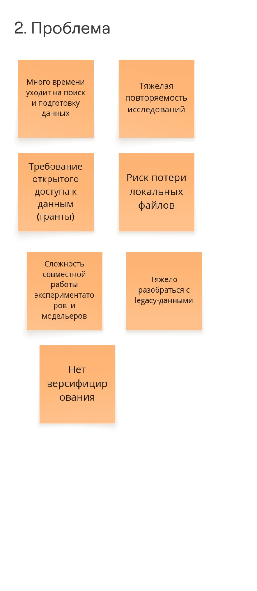
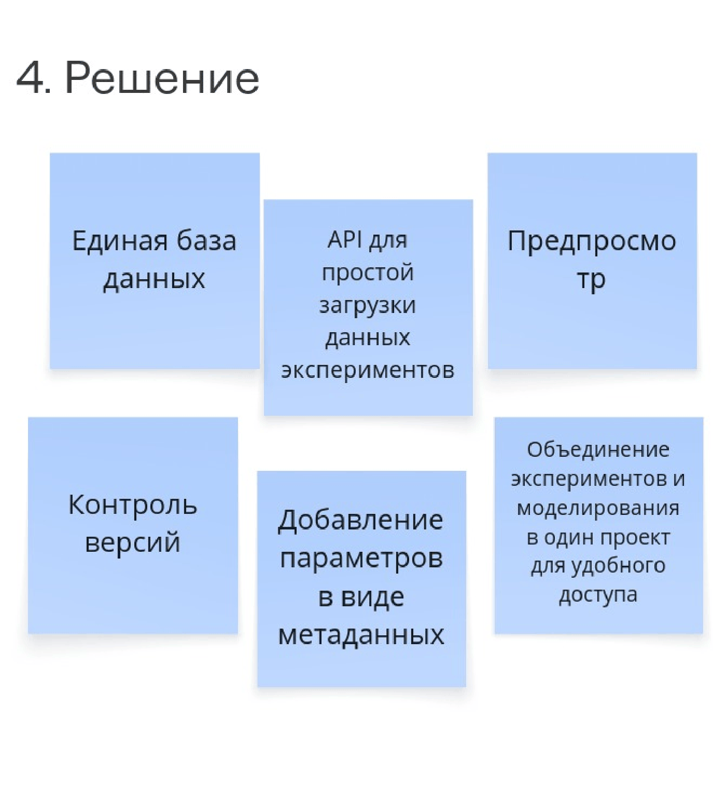
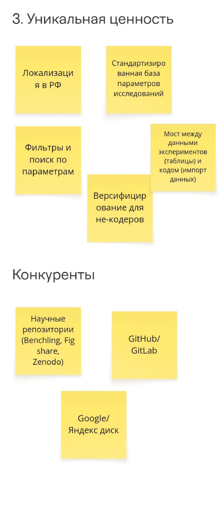
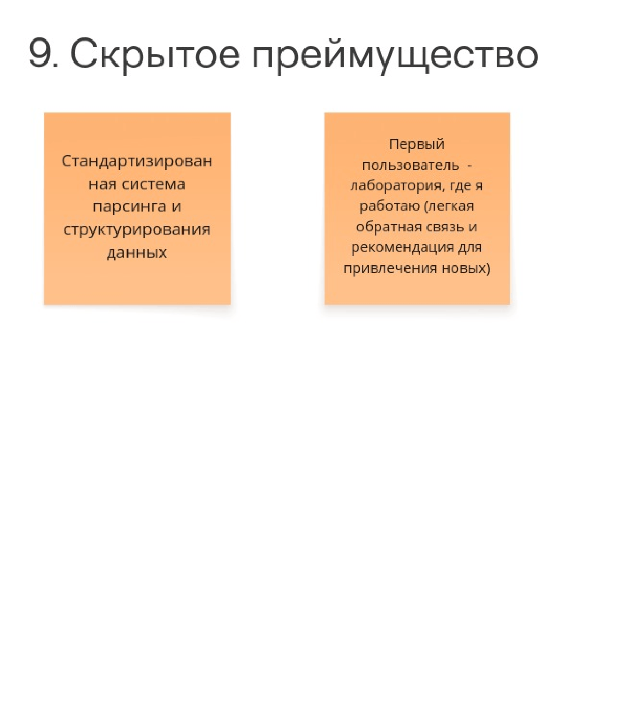
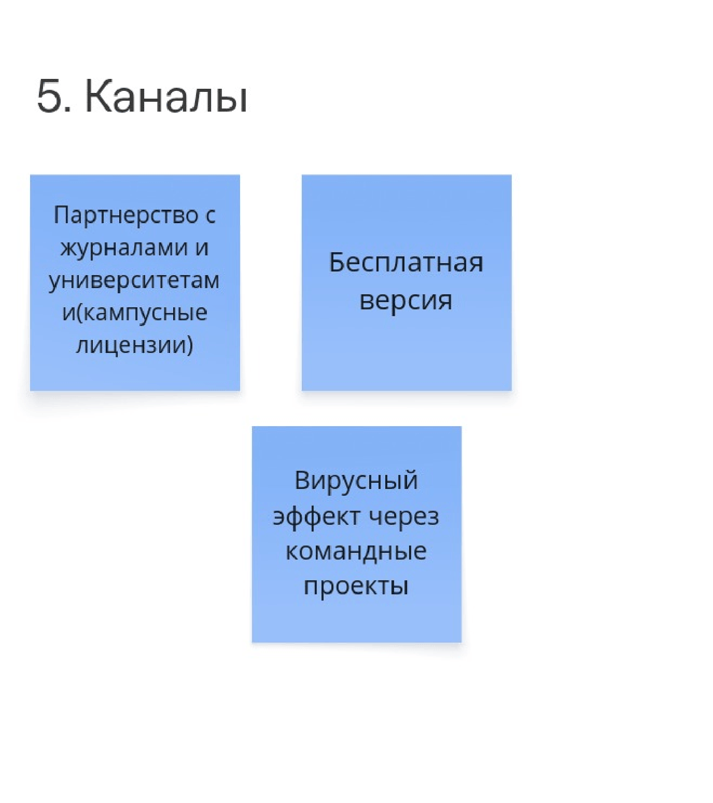
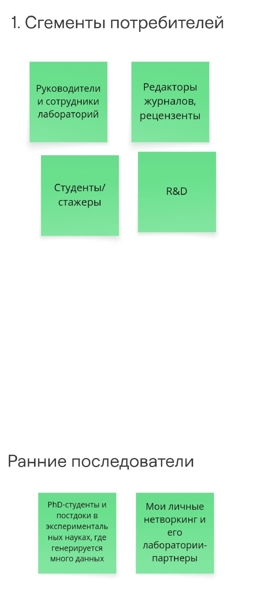
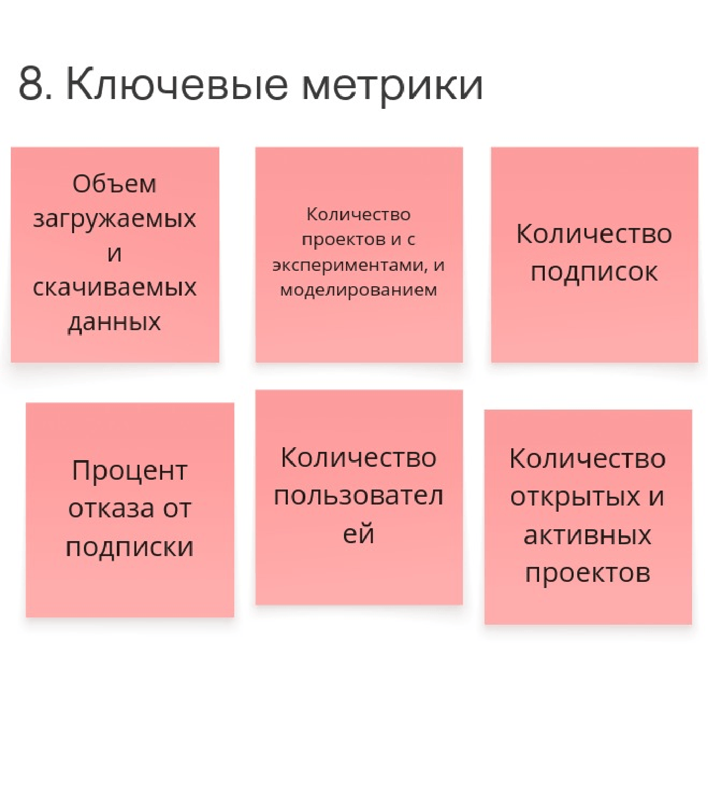

# VK-ProjManagment
Жуков Константин B2C

## Elevator Pitch
Ученые и R&D центры тратят очень много времени на поиск данных и связь экспериментов с моделями. Мы — специализированная база данных для исследований. В отличие от облачных дисков, мы внедряем стандарты метаданных, версионирование и прямой импорт в код через API. В результате сотрудники лабораторий экономят много времени, исключают потерю знаний и невоспроизводимость результатов, а так же могут удобно выполнять совместные проекты с коллегами.

## Lean Canvas

