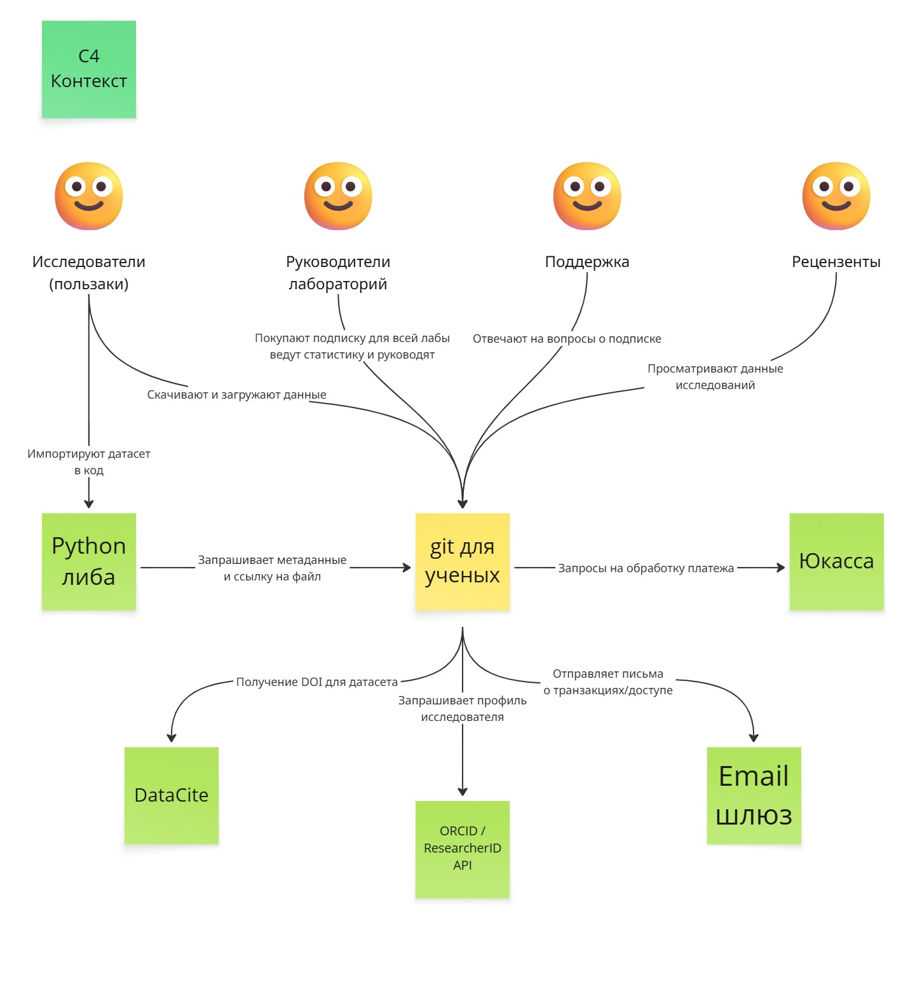
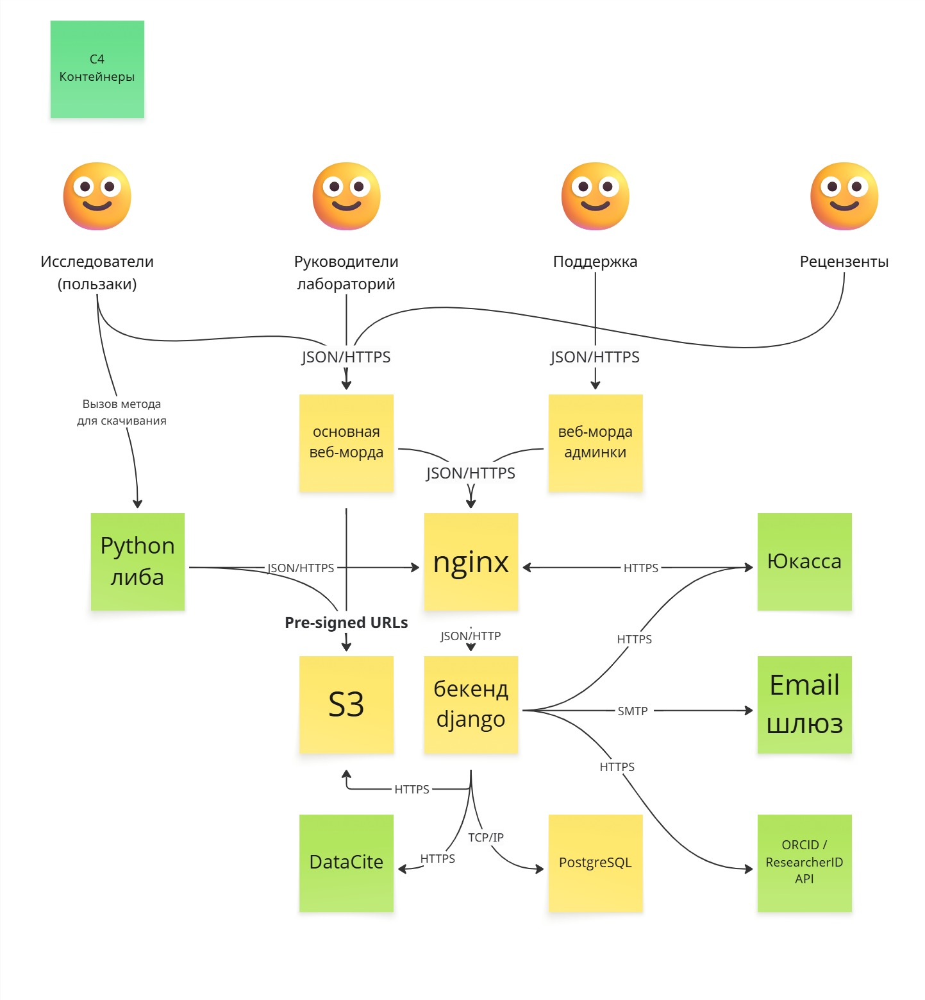

# VK-ProjManagment
Жуков Константин B2C

## Elevator Pitch
Ученые и R&D центры тратят очень много времени на поиск данных и связь экспериментов с моделями. Мы — специализированная база данных для исследований. В отличие от облачных дисков, мы внедряем стандарты метаданных, версионирование и прямой импорт в код через API. В результате сотрудники лабораторий экономят много времени, исключают потерю знаний и невоспроизводимость результатов, а так же могут удобно выполнять совместные проекты с коллегами.

## Lean Canvas
Отдельные фреймы лежат в [папке](./Lean_Canvas)

## MVP и MLP

## Проектирование

## Архитектура (C4)

### Стек технологий:
- Frontend - **React**. Богатая экосистема и поддержка SPA;
- Backend - **Python (django)**. Встроенная ORM и админ-панель - сэкономит время. Идеально для Datascience (целевая) и позволит без труда реализовать Python-библиотеку для импорта данных;
- БД - **PostreSQL**. Надежный и удобный JSONB для хранения метаданных об исследовании;
- Хранилище S3 - **Yandex Cloud Object Storage**. Соответствие требованиям о локализации данных в РФ и поддержка Pre-signed URLs для прямого доступа к данным без нагрузки на бэкенд;
- Балансировщик - **Nginx**. Фильтрует запросы, легкая настройка HTTPS, эффективно раздает статику;
- Кэш - **Redis**;
- Контейниризация - **Docker**.

## Управление разработкой
### Hiring Plan (Виртуальная команда MVP)
- Product Manager + Tech Lead
  - Сбор обратной связи, приоритизация бэклога и проверка соответствия сервиса требованиям научной работы.
  - Проектирование архитектуры БД и структуры API.
- Backend Developer (Python / Django)
  - Разработка REST API, интеграция с PostgreSQL и настройка безопасной работы с S3 хранилищем.
  - Написание Python-библиотеки для интеграции данных в код
- Frontend Developer (React)
  - Разработка интуитивно понятного интерфейса работы с формами ввода, фильтрами, таблицами и тд.
  - Настройка загрузки файлов и взаимодействия с API.
- UI/UX Дизайнер (можно в целом фрилансера)
  - Создание элементов интерфейса.

## Development Framework
**Kanban**, потому что:
1. На основе отзывов от первых темтировщиков могут часто прилетать новые требования и задачи. SCRUM не позволяет вставить их в спринт, а с Kanban можно сразу взять в работу.
2. Исправления багов лучше выкатывать по мере готовности, а не ждать конца спринта.
3. Для маленькой команды нет нужды в постоянных планированиях и оценки задач, доски будет достаточно

## Team Rituals
- Дейлики (ежедневно). Понять статус задачи и выявить блокеры. Просто каждый говорит что сейчас делает и есть ли проблемы.
- Груминг (раз в неделю). Совместное обсуждение новых фич, приоритезация задач и составление доски на следующую неделю.
- Demo (раз в 2 недели). Показать работающий кусок продукта реальному пользователю.
- Retro (раз в 2 недели). Обсуждение работы команды.

## Риски
- Пользователи не увидят преймуществ перед конкурентами (внешний)
  - Оценка: 3(влияние) * 2(вероятность) = 6.
  - Как **предотвратить**: собирать обратную связь с первых последователей и делать упор на уникальные фичи, которые понравились больше всего - улучшать дизайн и удобство использования.
- Пользователи будут пользоваться бесплатной версией для хранения запрещенки (внешний)
  - Оценка: 3(влияние) * 3(вероятность) = 9.
  - Как **предотвратить**: установить контроль доступа для бесплатной версии - просматривать и делать изменения в одних и тех же записях могут макисмум 2 человека; принимать файлы только определенных форматов.
- Хранилище забьется кучей "мусорных" данных от пользователей на бесплатной версии (внутренний)
  - Оценка 3(влияние) * 3(вероятность) = 9.
  - Как **смягчить**: добавить ограничение на хранимый объем - до 5 Гб на пользователя; удалять старые проекты, в которые никто не заходил больше года (с предварительным уведомлением автору)
- Университеты не доверят хранить данные на нашем сервисе из-за страха утечки или нарушения NDA (внешний)
  - Оценка 3(влияние) * 2(вероятность) = 6.
  - Как **смягчить**: Четко прописать в пользовательском соглашении, что вы не претендуете на права на данные. Получить сертификат соответствия серверов ФЗ-152 (обработка данных в РФ).
- Потеря целостности данных при загрузке и не только (внутренний)
  - Оценка 3(влияние) * 1(вероятность) = 3.
  - По таблице стоит передать, но логичнее **предотвратить**: регулярно создавать бэкапы БД и проверять контрольную сумму при загрузке файлов в S3 хранилище.
